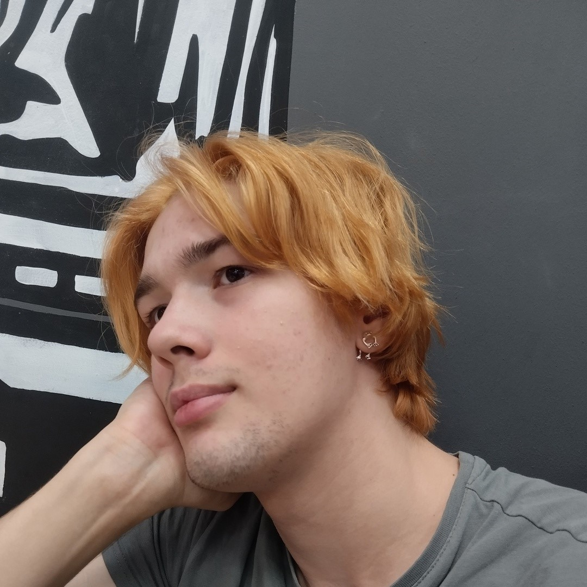

# 🐸 Welcome to MIDIFrogs! 

> Where music, programming and froggy memes unite! 🎵

## 🎮 Who Are We?

We're a group of student developers from South Ural State University (SUSU) in Chelyabinsk, Russia, who love creating games and AI-powered applications!

### 🛠️ What We Do

- 🎲 **Game Development**: We create awesome 2D Unity games during game jams
- 🤖 **AI & Computer Vision**: We build smart applications during hackathons
- 🏆 **Competitions**: We love participating in development competitions!

### 🚀 Tech Stack

## 👥 Meet The Team
Here is the full frogs squad with links to our Telegram, you can contact us with just clicking by name!

### 🎨 Creative Squad

  

    
    

        <strong>Alexey <a href="https://t.me/DJsonSun">"TWorker"</a> Zhaliy</strong> 
        Our Design Maestro
    

  

  

    
    

        <strong>Daniel <a href="https://t.me/da4ch4nik">"klumbrik"</a> Kudzoev</strong> 
        Pixel Perfect Artist
    

  

  

    
    

        <strong>Karina <a href="https://t.me/kkkira_kh">"kkkiraaa"</a> Khmeleva</strong> 
        Creative Artist
    

  

  

    
    

        <strong>Dmitriy <a href="https://t.me/Dexitti">"Dexitti"</a> Yakovlev</strong> 
        Artist & Code Wizard
    

  

### 💻 Tech Wizards

  

    
    

        <strong>Maxim <a href="https://t.me/jojer_m">"jojer"</a> Odincov</strong> 
        Development Guru
    

  

  

    
    

        <strong>Ivan <a href="https://t.me/ioexcept10n">"IOExcept10n"</a> Olyanishin</strong> 
        Code Architect
    

  

  

    
    

        <strong>Alexander <a href="https://t.me/WiverLord">"WiverLord"</a> Potekhin</strong> 
        Security Guardian
    

  

### 🎵 Sound Master

  

    
    

        <strong>Roman <a href="https://t.me/konekodayo">"rommi"</a> Sviridov</strong> 
        Music Magician
    

  

## 🥇 Our Achievements

### 🎮 Games
- **[Spirit Sorcerer](https://ldjam.com/events/ludum-dare/55/spirit-sorcerer)** - A card game for Ludum Dare 55 where players control a witch battling various monsters with spells.
- **[Merchant Chronicles](https://jojer-midifrogs.itch.io/being-a-merchant)** - A point-and-click RPG merchant simulator developed for SibGameJam 2024.
- **[The Bubblefly Effect](https://globalgamejam.org/games/2025/bubblefly-effect-7)** - A platformer where players control a bubble hero using wind currents, created for GGJ2025.

### 🤖 Hackathons
- **2nd Place** at the regional hackathon "Digital Breakthrough: AI Season" in 2024, developing an application for automatic processing of employment records. Participated in the all-Russian and international stages but did not win prizes. [Project Link](https://github.com/IOExcept10n/HandwritingRecognition)
- **3rd Place** at the regional hackathon "Ural Code", creating a service for detecting safety violations on automated production lines. [Project Link](https://github.com/MIDIFrogs/SafeFactory)
- **3rd Place** at the interregional hackathon by Intec, developing a website for searching objects and text in photos. [Project Link](https://github.com/MIDIFrogs/IntecHack)

## 🌟 Fun Facts

- We have a secret hackathon squad called "PedroTeam" (inspired by a dancing raccoon meme! 🦝)
- Once, during a hackathon, we filmed a video for a little video-contest all night long. After finishing the video and preparing our project for submission, we went to play at a computer club before the defense. This didn't hinder us at all; in fact, it helped! We won a game of Valorant at the club and took 2nd place in the hackathon, also winning a laptop for the video we made. We think this is a great way to showcase our multitasking skills! 

## 🤝 Join the Pond!

Whether you're into game development, AI, or just want to collaborate on some cool projects, we'd love to have you help us! Feel free to:
- 🐛 Open issues
- 🛠️ Submit pull requests
- 💡 Share your ideas

## 📫 Hop Into Our Network

Stay tuned for our Telegram channel link coming soon!

---

*"Where every commit is a lily pad towards success! 🌿"*

